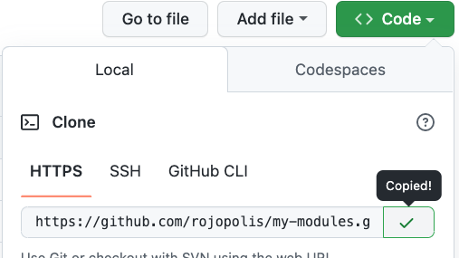
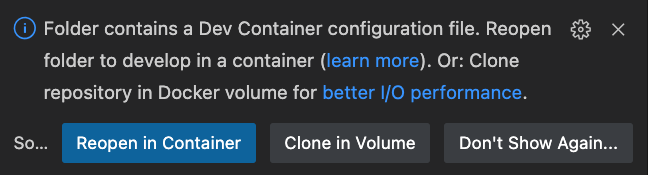

# Terraform modules repo

Terraform works best when modules are separated from root configs.  The best
way to achive this is to create separate repositories.

## Clone my repo

1. git clone https://github.com/bananalab/terraform-modules

## Create your repo

1. Browse to https://github.com/bananalab/terraform-modules-template
2. Create your own repo: 
3. Give your repo a sensible name: 
4. Clone your repo: 

## Begin coding


## Dev container

This project uses devcontainers to ensure a common development environment for all users.  The devcontainer automatically installs all tools needed for Terraform development.  In order to enable the devcontainer select 'Reopen in container'



## Create a module

From within your modules repo run `make module my-module`.

### Try your module

```bash
cd modules/my-module/examples/simple
terraform init
terraform apply
```

### Commit your code

```bash
git add -A
git commit -m 'feat: Initial commit.'
```
>> notice the `feat:` prefix! (This is a [Conventional Commit](https://www.conventionalcommits.org/en/v1.0.0/))

### Pre-commit hooks

1. [Checkov](https://www.checkov.io/1.Welcome/Quick%20Start.html)
2. [Terraform Docs](https://terraform-docs.io/user-guide/introduction/)
3. [Terraform Lint](https://github.com/terraform-linters/tflint#tflint)

Fix any pre-commit errors.

push your code to GitHub

```bash
git push
```

### Tests

Look at the Github Checks... See that tests were run.

### Merge Pull Request

Merging will trigger a release.
See: https://github.com/google-github-actions/release-please-action

Due to recent changes in Github permissions must be altered:


Merge release Pull Request