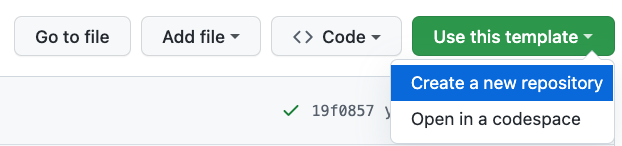
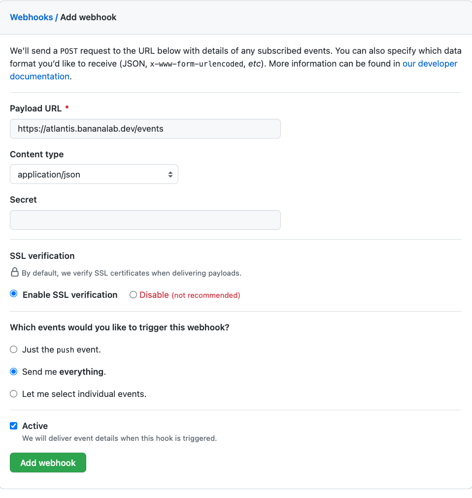

# Terraform Live

The Terraform Live repository represents the desired state of the
infrastructure.  Reusable modules are consumed by Terraform Live

## Create your repo

1. Browse to https://github.com/bananalab/terraform-live-template
2. Create your own repo: 
3. Give your repo a sensible name: 
4. Clone your repo: 

## Deploy infrastructure

Edit `terraform.tfvars`

Edit `versions.tf`

```bash
backend "s3" {
    bucket = "terraform-20221206184034105500000001"
    key = "atlantis.tfstate"
    region = "us-west-1"
  }
```

```bash
cd atlantis/infrastructure/aws
terraform init
terraform apply
```

Open the AWS Console and see what was created

## Configure your repo



## Create a branch and push changes

edit `data.tf`

```bash
git checkout -b 'my-feature'
git add -A
git push
```
